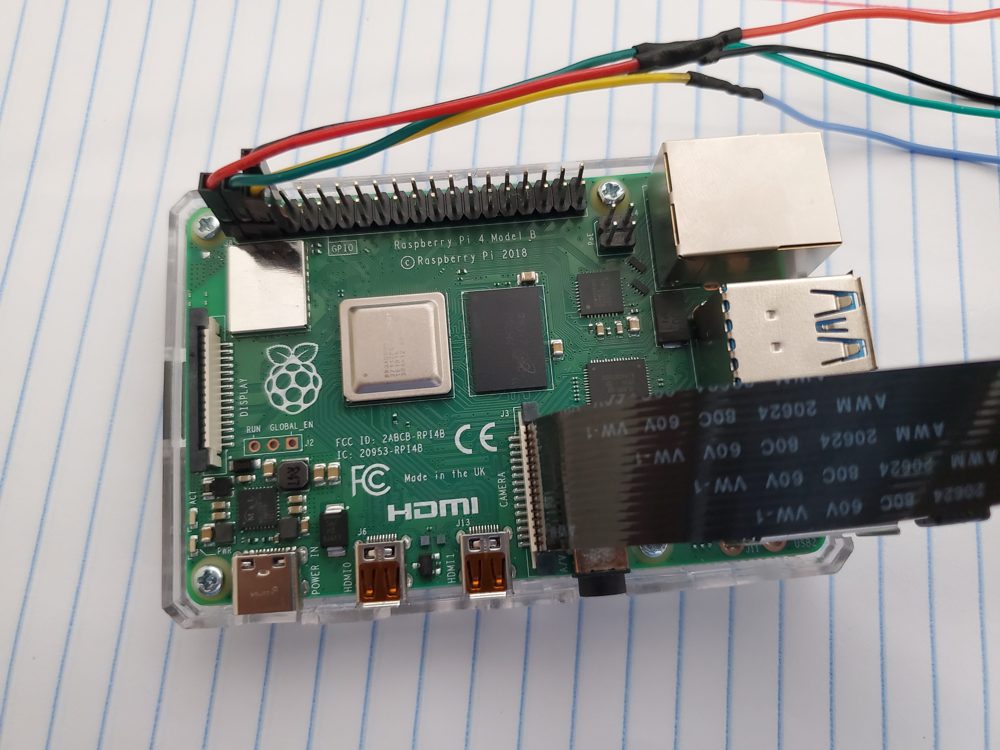
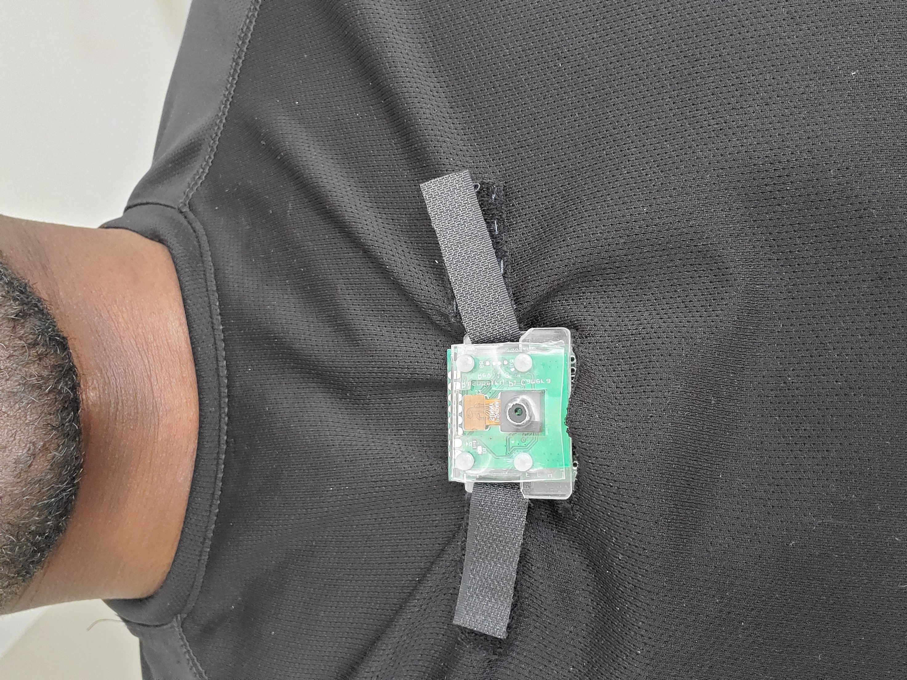
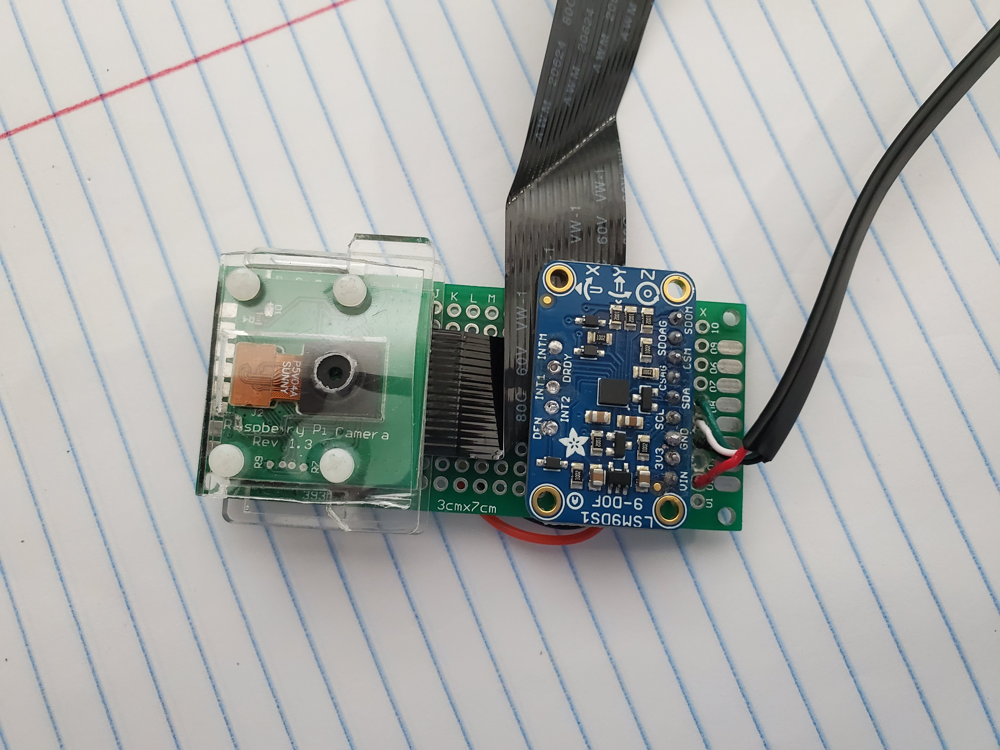

# Wearable1

This is the first part of an ongoing project to create an smart wearable system. The idea for the part is to have a body-worn camera (picamera) located on the chest stream through the raspberry pi, like a police body-cam. The output of the stream displays data to the viewer about the person wearing the system (i.e., heading, temperature, pulse, breathing, etc.).  The current script uses an IMU and picamera to display heading and temperature on video output, write sensor data to a csv file, and record the output to a video file.

 Requirements
 The program uses Python3, Opencv, and several libraries
 
 # Hardware
 My setup:
 - Raspberry Pi 4 4GB: https://www.raspberrypi.org/products/raspberry-pi-4-model-b/
 - LSM9DS1 IMU: https://www.adafruit.com/product/3387
 - Raspberry Pi Camera & Case: https://www.amazon.com/gp/product/B07TXKTN8P/ref=ppx_yo_dt_b_asin_title_o05_s00?ie=UTF8&psc=1
 - 2ft Picamera cable: https://www.amazon.com/gp/product/B07J68TJ7L/ref=ppx_yo_dt_b_asin_title_o07_s00?ie=UTF8&psc=1
 - Portable Power: https://www.amazon.com/gp/product/B00MQSMEEE/ref=ppx_yo_dt_b_asin_title_o07_s01?ie=UTF8&psc=1
 
 Some challenging topics faced creating this were:
 - Overlaying transparent images to opencv video output
 - Moving/animating objects in real time-video output
 - Writing sensor data to file
 - Output real-time sensor data to video output
 
# Next Steps

I am working to use a gas sensor, SGP30 or another, to measure the breathing rate by placing the sensor in front of the mouth ( in a mask or helmet). The sensor would measure the levels of CO2.

I will be testing out this kit https://www.adafruit.com/product/1077, to display and record to user's heart rate.

I want to interface the script running on the raspberry pi to an android app via bluetooth for commands, and data transfer. I will look into using this interface to input GPS data from the smartphone as input to the system as well, as using the smartphones network to possible stream the video/data output to a webhost.
